  <picture>
    <source media="(prefers-color-scheme: dark)" srcset="assets/dark.svg">
    <source media="(prefers-color-scheme: light)" srcset="assets/light.svg">
    
  </picture>

  
  
  
  

---

### 🧑‍💻 About Me

I'm a Full-Stack Developer who enjoys building web apps with **React** and **Spring Boot**. Currently doing my Master's in Canada and always looking to learn something new.

- 🎓 **Master's in Applied Computer Science** — Concordia University, Montreal
- 🎓 **B.Tech in Information Technology** — Coimbatore Institute of Technology, India
- � Former **Data Assurance Analyst** at **Ernst & Young**
- �📫 Reach me at **agharsha.anbu@gmail.com**

---

### 🛠️ Tech Stack

**Frontend**

  
  
  

**Backend**

  
  
  
  

**Databases**

  
  
  

**Cloud & DevOps**

  
  
  
  

**Tools & Practices**

  
  
  
  
  

---

### 🚀 Projects

| Project                                                                   | Tech                           | Repo                                                 |
| ------------------------------------------------------------------------- | ------------------------------ | ---------------------------------------------------- |
| **ToWin** — Full-stack platform connecting elders & helpers (main project) | React · Spring Boot · Docker | [View](https://github.com/Harsha-anbu-g/Towin) |
| **Quiz App** — RESTful quiz backend with CRUD & score calculation         | Spring Boot · PostgreSQL · JPA | [View](https://github.com/Harsha-anbu-g/quiz-spring) |
| **Book Review Analytics** — Distributed analysis of ~3M reviews using MPI | Python · Docker · MPI · Pandas | [View](https://github.com/Harsha-anbu-g/docker-mpi)  |

---

  <em>I'm open to full-time and part-time opportunities. Let's connect!</em>

